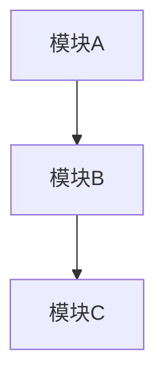

# {{title}}

> [!info] 项目概述
> 简要描述项目的目标、功能和特点

## 项目背景

<!-- 描述项目产生的背景和要解决的问题 -->

## 技术栈

- **前端**：
- **后端**：
- **数据库**：
- **其他工具**：

## 系统架构



## 核心功能

### 功能1

<!-- 详细说明 -->

### 功能2

<!-- 详细说明 -->

## 实现细节

### 核心代码

```code
// 关键代码实现
```

### 关键算法

<!-- 算法说明 -->

## 遇到的问题与解决

### 问题1

> [!warning] 问题描述
> 详细描述遇到的问题

**解决方案**：
<!-- 解决方案说明 -->

## 项目成果

### 实现功能

- [x] 功能1
- [x] 功能2
- [ ] 待实现功能

### 技术收获

1. **技术点1**：具体收获
2. **技术点2**：具体收获

## 部署与使用

### 本地运行

```bash
# 安装依赖
npm install

# 启动项目
npm run dev
```

### 部署说明

<!-- 部署步骤 -->

## 未来改进

- [ ] 改进点1
- [ ] 改进点2
- [ ] 新功能开发

## 相关资源

- [项目源码](GitHub地址)
- [在线演示](演示地址)
- [技术文档](文档地址)

## 总结

<!-- 项目总结和反思 -->

---

*项目时间：{{date:YYYY-MM-DD}}*
*技术栈：填写主要技术*
*分类：build/{{folder}}*
