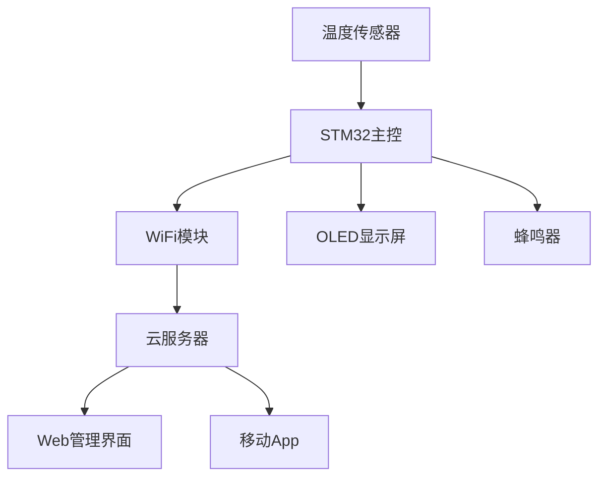

# 智能温度计项目

> [!info] 项目概述
> 设计并实现一个基于STM32的智能温度计，具备无线传输、数据记录和远程监控功能

## 项目背景

传统温度计只能进行本地读数，无法实现远程监控和数据记录。本项目旨在开发一个智能温度监控系统，解决以下需求：

- 实时温度监测
- 无线数据传输
- 历史数据记录
- 移动端远程查看
- 异常温度报警

## 系统架构



## 硬件设计

### 核心器件选择

| 器件 | 型号 | 功能 | 原因 |
|------|------|------|------|
| 主控MCU | STM32F103C8T6 | 系统控制 | 性价比高，外设丰富 |
| 温度传感器 | DS18B20 | 温度采集 | 精度高，单总线接口 |
| WiFi模块 | ESP8266 | 无线通信 | 成本低，易于集成 |
| 显示屏 | SSD1306 OLED | 本地显示 | 功耗低，显示清晰 |

### 电路原理图

> [!tip] 设计要点
> 1. 3.3V和5V电源分离设计
> 2. 增加滤波电容提高稳定性
> 3. 预留扩展接口

```
STM32F103C8T6
├── PA0  ←→ DS18B20 (数据线)
├── PA1  ←→ ESP8266 TX
├── PA2  ←→ ESP8266 RX  
├── PB6  ←→ OLED SCL
├── PB7  ←→ OLED SDA
└── PA3  ←→ 蜂鸣器
```

### PCB设计考虑

- **布线规则**：模拟信号与数字信号分离
- **电源设计**：采用LDO稳压，增加去耦电容
- **电磁兼容**：WiFi模块远离晶振，增加屏蔽措施

## 软件实现

### 系统框架

```c
// 主程序结构
int main(void)
{
    // 系统初始化
    System_Init();
    
    // 任务调度
    while(1)
    {
        Temperature_Task();    // 温度采集任务
        Display_Task();        // 显示更新任务
        WiFi_Task();          // 网络通信任务
        Alarm_Task();         // 报警检测任务
        
        HAL_Delay(100);
    }
}
```

### 温度采集模块

```c
#include "ds18b20.h"

float Get_Temperature(void)
{
    uint8_t temp_data[2];
    float temperature;
    
    // 启动转换
    DS18B20_Start_Conversion();
    
    // 等待转换完成
    HAL_Delay(750);
    
    // 读取温度数据
    DS18B20_Read_Data(temp_data);
    
    // 数据处理
    temperature = (temp_data[1] << 8 | temp_data[0]) * 0.0625;
    
    return temperature;
}
```

### WiFi通信模块

```c
#include "esp8266.h"

void WiFi_Send_Data(float temperature)
{
    char json_data[128];
    
    // 构造JSON数据
    sprintf(json_data, 
        "{\"device_id\":\"TH001\",\"temperature\":%.2f,\"timestamp\":%ld}",
        temperature, HAL_GetTick());
    
    // 发送到服务器
    ESP8266_Send_HTTP_POST("api.example.com", "/data", json_data);
}
```

### OLED显示模块

```c
#include "ssd1306.h"

void Display_Update(float temperature)
{
    char temp_str[16];
    
    // 清屏
    SSD1306_Clear();
    
    // 显示标题
    SSD1306_SetCursor(0, 0);
    SSD1306_WriteString("Smart Thermometer", Font_7x10, White);
    
    // 显示温度
    sprintf(temp_str, "Temp: %.2f C", temperature);
    SSD1306_SetCursor(0, 20);
    SSD1306_WriteString(temp_str, Font_11x18, White);
    
    // 显示WiFi状态
    if(WiFi_Connected())
    {
        SSD1306_SetCursor(0, 45);
        SSD1306_WriteString("WiFi: Connected", Font_7x10, White);
    }
    
    // 刷新显示
    SSD1306_UpdateScreen();
}
```

## 云端服务

### 数据库设计

```sql
CREATE TABLE temperature_data (
    id INT AUTO_INCREMENT PRIMARY KEY,
    device_id VARCHAR(20) NOT NULL,
    temperature DECIMAL(5,2) NOT NULL,
    humidity DECIMAL(5,2),
    timestamp DATETIME DEFAULT CURRENT_TIMESTAMP,
    location VARCHAR(50)
);

CREATE INDEX idx_device_time ON temperature_data(device_id, timestamp);
```

### API接口

```javascript
// Node.js + Express
app.post('/api/data', (req, res) => {
    const { device_id, temperature, timestamp } = req.body;
    
    // 数据验证
    if (!device_id || temperature === undefined) {
        return res.status(400).json({ error: 'Invalid data' });
    }
    
    // 存储数据
    db.query(
        'INSERT INTO temperature_data (device_id, temperature, timestamp) VALUES (?, ?, ?)',
        [device_id, temperature, new Date(timestamp)],
        (err, result) => {
            if (err) {
                return res.status(500).json({ error: 'Database error' });
            }
            res.json({ success: true, id: result.insertId });
        }
    );
});

// 获取历史数据
app.get('/api/data/:device_id', (req, res) => {
    const { device_id } = req.params;
    const { start_date, end_date } = req.query;
    
    db.query(
        'SELECT * FROM temperature_data WHERE device_id = ? AND timestamp BETWEEN ? AND ? ORDER BY timestamp DESC',
        [device_id, start_date, end_date],
        (err, results) => {
            if (err) {
                return res.status(500).json({ error: 'Database error' });
            }
            res.json(results);
        }
    );
});
```

## 移动端应用

### Flutter实现

```dart
class TemperatureChart extends StatefulWidget {
  @override
  _TemperatureChartState createState() => _TemperatureChartState();
}

class _TemperatureChartState extends State<TemperatureChart> {
  List<TemperatureData> chartData = [];
  
  @override
  void initState() {
    super.initState();
    fetchTemperatureData();
  }
  
  Future<void> fetchTemperatureData() async {
    final response = await http.get(
      Uri.parse('https://api.example.com/data/TH001')
    );
    
    if (response.statusCode == 200) {
      final List<dynamic> data = json.decode(response.body);
      setState(() {
        chartData = data.map((item) => TemperatureData(
          DateTime.parse(item['timestamp']),
          item['temperature'].toDouble()
        )).toList();
      });
    }
  }
  
  @override
  Widget build(BuildContext context) {
    return SfCartesianChart(
      primaryXAxis: DateTimeAxis(),
      series: <ChartSeries>[
        LineSeries<TemperatureData, DateTime>(
          dataSource: chartData,
          xValueMapper: (TemperatureData data, _) => data.time,
          yValueMapper: (TemperatureData data, _) => data.temperature,
        )
      ],
    );
  }
}
```

## 测试与验证

### 功能测试

- [x] 温度采集精度测试（±0.5°C）
- [x] WiFi连接稳定性测试
- [x] 数据传输完整性验证
- [x] 报警功能测试
- [x] 电源功耗测试

### 性能指标

| 指标 | 规格 | 实测值 | 状态 |
|------|------|--------|------|
| 测量精度 | ±0.5°C | ±0.3°C | ✅ |
| 响应时间 | <2s | 1.2s | ✅ |
| 工作电流 | <100mA | 85mA | ✅ |
| WiFi范围 | 50m | 60m | ✅ |

## 项目成果

### 实现功能

✅ **基础功能**
- 实时温度监测和显示
- 无线数据传输
- 历史数据记录

✅ **扩展功能**  
- 移动端远程监控
- 异常温度报警
- 数据可视化图表

✅ **优化特性**
- 低功耗设计
- 用户友好界面
- 故障自诊断

### 技术收获

1. **硬件设计**：PCB布线、电磁兼容、电源管理
2. **嵌入式编程**：STM32 HAL库、实时操作系统
3. **无线通信**：WiFi协议栈、网络编程
4. **全栈开发**：前后端分离、RESTful API
5. **移动开发**：Flutter跨平台应用

## 未来改进

### 短期优化

- [ ] 增加湿度传感器
- [ ] 优化电池续航时间
- [ ] 添加OTA升级功能

### 长期规划

- [ ] 支持多传感器组网
- [ ] 集成机器学习预测
- [ ] 开发商业化产品

## 相关资源

- [项目源码 (GitHub)](https://github.com/example/smart-thermometer)
- [PCB设计文件](https://oshwlab.com/project/smart-thermometer)
- [移动端App下载](https://github.com/example/thermometer-app/releases)
- [API文档](https://docs.example.com/thermometer-api)

## 总结

通过这个项目，成功实现了一个完整的物联网温度监控系统。项目涵盖了硬件设计、嵌入式编程、云端服务和移动应用开发等多个技术领域，为后续的物联网项目积累了宝贵经验。

项目的成功关键在于：
1. **系统性思维**：从需求分析到产品实现的完整流程
2. **技术选型**：在成本和性能之间找到平衡
3. **迭代开发**：快速原型验证，逐步完善功能
4. **文档管理**：详细记录设计决策和技术细节

---

*项目时间：2024年1月*  
*技术栈：STM32, ESP8266, Node.js, Flutter*  
*分类：build/hardware*
