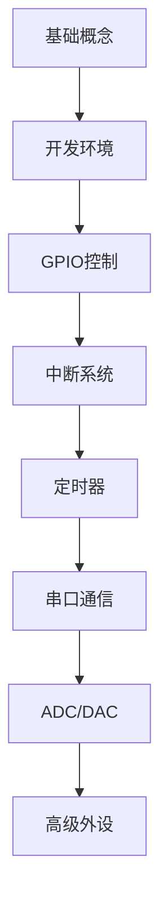

# STM32基础入门

> [!info] 学习目标
> 了解STM32微控制器的基本架构、开发环境搭建和简单程序编写

## 概述

STM32是意法半导体(STMicroelectronics)推出的基于ARM Cortex-M内核的32位微控制器系列。它具有高性能、低功耗、丰富外设等特点，广泛应用于嵌入式系统开发。

## STM32系列分类

### 主流系列

- **STM32F0系列**：入门级，Cortex-M0内核
- **STM32F1系列**：主流产品，Cortex-M3内核  
- **STM32F4系列**：高性能，Cortex-M4内核
- **STM32H7系列**：最高性能，Cortex-M7内核

### 低功耗系列

- **STM32L0/L1/L4/L5系列**：超低功耗应用

## 开发环境搭建

### 官方IDE：STM32CubeIDE

```bash
# 下载地址
https://www.st.com/en/development-tools/stm32cubeide.html
```

### 第三方IDE选择

1. **Keil MDK-ARM**
2. **IAR Embedded Workbench**
3. **PlatformIO** (基于VSCode)

> [!tip] 推荐
> 初学者建议使用STM32CubeIDE，集成度高，配置简单

## 硬件连接

### 最小系统

```
VDD  -----> 3.3V
VSS  -----> GND
VDDA -----> 3.3V (模拟电源)
VSSA -----> GND  (模拟地)
BOOT0 ----> GND  (从Flash启动)
NRST -----> 上拉10KΩ到3.3V
```

### 外部晶振（可选）

```
HSE: 8MHz晶振 + 22pF电容x2
LSE: 32.768KHz晶振 + 22pF电容x2
```

## 第一个程序：LED闪烁

### 硬件准备

- STM32开发板
- LED + 限流电阻
- 连接线

### 代码实现

```c
#include "main.h"

// 系统时钟配置
void SystemClock_Config(void);
// GPIO初始化
void MX_GPIO_Init(void);

int main(void)
{
    // 硬件抽象层初始化
    HAL_Init();
    
    // 配置系统时钟
    SystemClock_Config();
    
    // 初始化GPIO
    MX_GPIO_Init();
    
    while (1)
    {
        // LED亮
        HAL_GPIO_WritePin(GPIOC, GPIO_PIN_13, GPIO_PIN_SET);
        HAL_Delay(500);
        
        // LED灭
        HAL_GPIO_WritePin(GPIOC, GPIO_PIN_13, GPIO_PIN_RESET);
        HAL_Delay(500);
    }
}

void MX_GPIO_Init(void)
{
    GPIO_InitTypeDef GPIO_InitStruct = {0};
    
    // 使能GPIO时钟
    __HAL_RCC_GPIOC_CLK_ENABLE();
    
    // 配置PC13为输出模式
    GPIO_InitStruct.Pin = GPIO_PIN_13;
    GPIO_InitStruct.Mode = GPIO_MODE_OUTPUT_PP;
    GPIO_InitStruct.Pull = GPIO_NOPULL;
    GPIO_InitStruct.Speed = GPIO_SPEED_FREQ_LOW;
    HAL_GPIO_Init(GPIOC, &GPIO_InitStruct);
}
```

## 常见问题

### 编译错误

> [!warning] 注意事项
> 1. 检查芯片型号是否正确
> 2. 确认HAL库版本兼容性
> 3. 验证引脚配置是否冲突

### 下载失败

```bash
# 检查连接
1. 确认ST-Link连接正常
2. 检查BOOT0引脚状态
3. 尝试擦除Flash后重新下载
```

## 学习路径



## 相关资源

- [STM32官方文档](https://www.st.com/en/microcontrollers-microprocessors/stm32-32-bit-arm-cortex-mcus.html)
- [STM32CubeMX配置工具](https://www.st.com/en/development-tools/stm32cubemx.html)
- [HAL库函数手册](https://www.st.com/en/embedded-software/stm32cube-mcu-mpu-packages.html)

## 总结

STM32作为主流的32位微控制器，具有完善的生态系统和丰富的学习资源。通过系统性学习，可以掌握嵌入式系统开发的核心技能。

下一步学习方向：
- [ ] 中断系统的使用
- [ ] 定时器应用实例  
- [ ] 串口通信协议
- [ ] PWM波形生成

---

*创建时间：2024-01-15*
*分类：learn/MCU/STM32*
